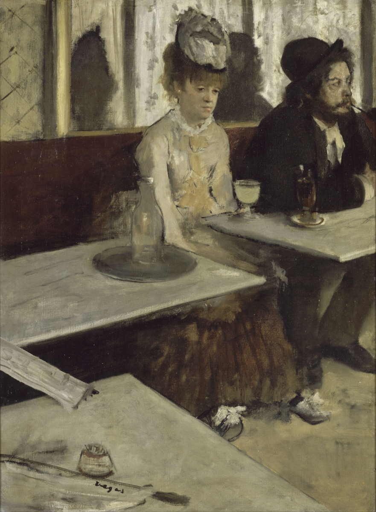

<!DOCTYPE html>
<html lang="it">
<head>
<meta charset="UTF-8">
<meta name="viewport" content="width=device-width, initial-scale=1.0">

<title>Art Gallery</title>

<link href="https://fonts.googleapis.com/css2?family=Playfair+Display:wght@500;700&family=Inter:wght@300;400;500&display=swap" rel="stylesheet">

</head>

<body>

<header>
    <h1>Art Gallery</h1>
    
Clicca un’opera per esplorarne la storia

</header>

    

        
    

    

        
    

    

        
    

<!-- MODAL -->

    

        

        
clicca fuori per chiudere

    

</body>
</html>
