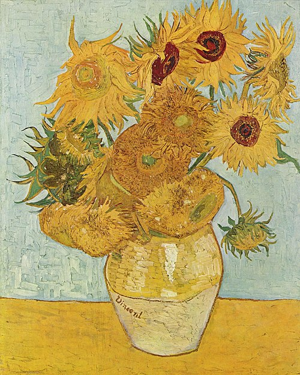

<!DOCTYPE html>
<html lang="it">
<head>
<meta charset="UTF-8">
<title>Aesthetic Art Gallery</title>

<link rel="preconnect" href="https://fonts.googleapis.com">
<link rel="preconnect" href="https://fonts.gstatic.com" crossorigin>
<link href="https://fonts.googleapis.com/css2?family=Playfair+Display:wght@500;700&family=Inter:wght@300;400;500&display=swap" rel="stylesheet">

</head>

<body>

<h1>Art Gallery</h1>

clicca un'opera per scoprire la sua storia

</body>
</html>
